# 
Multi-view Inference for Relation Extraction with Uncertain Knowledge

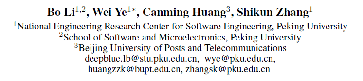

北京大学软微/软工 北京邮电大学

AAAI 2021 (CCF A, CORE A*, QUALIS A1) 

该工作未公布源代码

利用不确定的知识来改进关系提取

多视图推理框架系统地将本地上下文和全局知识集成到三个视图： mention, entity, concept -view

<!--

知识图 (KG) 广泛用于辅助关系提取 (RE) 任务。虽然大多数以前的 RE 方法都专注于利用确定性 KG，但为每个关系实例分配置信度分数的不确定 KG 可以提供关系事实的先验概率分布，作为 RE 模型的有价值的外部知识。

本文提出利用不确定的知识来改进关系提取。具体来说，我们将 ProBase（一种表示目标实体在多大程度上属于某个概念的不确定性知识图谱）引入我们的 RE 架构。

然后，我们设计了一个新颖的多视图推理框架，以系统地将本地上下文和全局知识集成到三个视图中： mention, entity, concept -view

实验结果表明，我们的模型在句子级和文档级关系提取上都取得了有竞争力的表现，验证了引入不确定知识和我们设计的多视图推理框架的有效性。

-->

---

## Intro

知识图（KGs）包含预定义的节点和它们之间的关系，已经被广泛用于 RE 整合不同的先验知识。

KGs 和 RE 的交互分为两个层面：直接构造远程监督数据集、作为外部知识提升 RE 模型的表现。

<!--
既可以用于直接构造远程监督数据集，又可以作为外部知识提升 RE 模型的表现（后者也是本文的主题）。
-->

关于整合先验知识到 RE 模型中也有两种方式。一是明确使用结构化信息（直接从知识库检索），二是探索潜在的语义信息（实体嵌入和关系嵌入）。

 
 

<!--
但是已有的利用 KGs 的方法大多关注确定性 KGs，也就是在两个概念之间只有确定性的关系。但是另一种类型的 KGs，称为非确定 KGS，对两个单词和一个关系给出一个置信分数。这种概率分布也可以用于改善关系抽取。
-->

本文使用 ProBase 作为非确定 KGs，对一个实体，ProBase 给出多个概念的概率分布，表示这个实体属于（IsA）某个概念的概率。在有限上下文的情况下，这种信息可以带来补充知识。

ProBase 带来了实体 pair 相关概念的通用知识，而目标文档（或句子）则提供有关 mentions 的局部语义信息。

为了聚合不同视图的信息以获得特征向量，作者设计了一个多视图推理框架，系统地综合来自不同源和表示级别的上下文语义。（三个视图： mention, entity, concept -view）

---

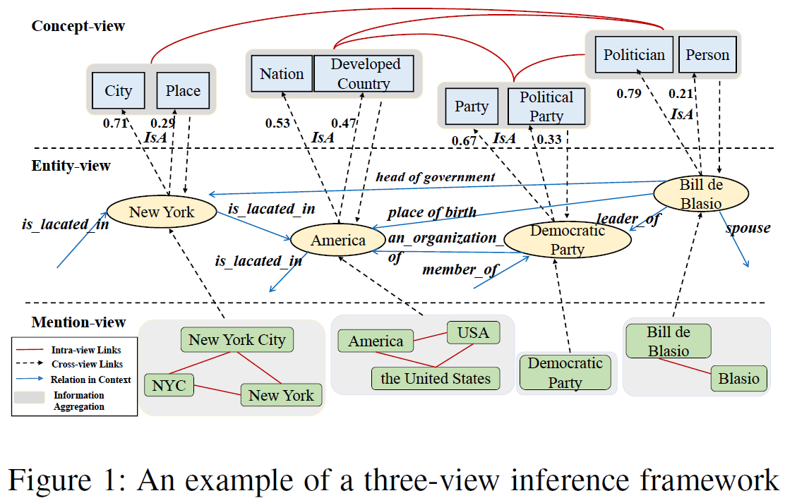

<!--
此处需要明确 mention entity concept 的区别和联系。
-->

---

由于维基百科中关于实体和概念的文本描述包含了大量的语义信息，我们从中检索 ProBase 中概念的描述，然后形成了一个超过 15000000 个实体和概念的描述的数据集，称为 ProBase_Desp，这个数据集已经开源。

本文贡献：

+ a Multi-view Inference framework for relation extraction with Uncertain Knowledge.

+ 用大量实验证明该模型在句子级和文档级关系抽取任务上都可以取得很好的效果

+ 构建并发布了一个大规模高质量的语料。

---

## 问题定义与输入

本文只关注文档级关系抽取，因为句子级关系抽取只是一种简化情况。

<!--
文档级和句子级关系抽取的问题是不同的。句子级关系抽取只需要实体视图和概念视图，文档级关系抽取还需要 mention 视图。
-->

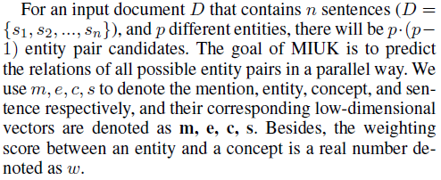

一篇文档包含多个句子，文档中有 $p$ 个实体。每个实体在整篇文档中有多个 mention，任务是预测每个实体对的关系。

<!--
（不同 mention 的 token 可能相同或不同）

在介绍模型之前需要有 2 点补充说明
-->

---

+ **位置编码**

<!--
在文档中，每个提及的位置信息对关系抽取也是很重要的，但无法直接编码到实体中。对于不同实体赋予一个不同的标记锚点，而对这个实体的每个提及都用这个标记包围起来，在编码时把这个锚点当作普通的 token。通过这种方式将位置信息融合到输入中。
-->

+ **维基描述**

<!--
作者对每个实体从 ProBase 中检索 top-K 的概念和相应的置信分数。对每个实体和概念检索维基百科中的前 2 个自然段。
-->

**所有的**维基描述都是用 BERT 和最大池化操作得到编码的。

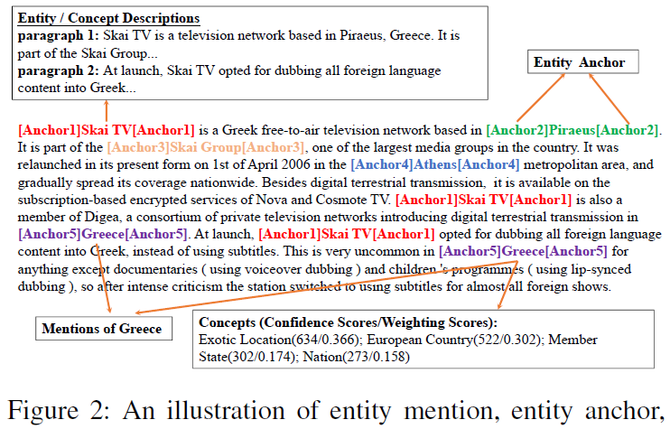

---

<!-- 
_backgroundImage: url(note.assets/2022-10-17-16-32-41-image.png);
_backgroundPosition: 50% 75%;
_backgroundSize: 95%
-->

## 多视图推理

<!--
整体框架如图 3 

分为两个部分：跨视图链接    信息聚合与混合注意力机制
-->

---

### 跨视图链接

这一部分主要是讲如何从输入语料、ProBase 和维基百科得到**实体对**的表示。

<!--
（所有操作以实体为核心）
-->

entity 的维基描述嵌入记为 $\mathbf{e}_d$  

+ 对于 Mention2Entity link：

某个 mention 的表示是将这个 mention 的所有 token 包括锚点的编码取均值，记为 $\mathbf{m}$ 。
$\mathbf{e}_d$ 与 $\mathbf{m}$ 通过注意力机制形成 entity 的 local representation $\mathbf{e}_l$ .

进而形成一对实体的局部表示 $\mathbf{u}_l$ .

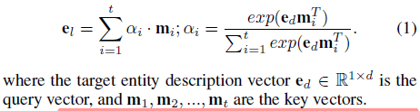
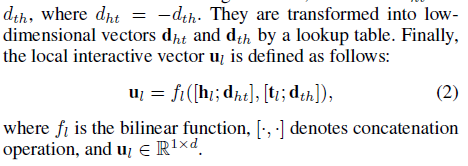

---

### 跨视图链接

+ 对于 Entity2Concept link：

对某个实体可取出 top-K 个概念，每个概念的维基描述都可以通过 BERT 得到嵌入 $\mathbf{c}_i$，然后可以通过多种机制形成总的概念表示 $\mathbf{c}$ .（实际上本文提出了NWI、AWI、PWI 三种方式发现 PWI 最好）

<!--
AWI 指的是 Attention-based Weighting Integration，基于 c 和【实体局部表示】的相似性。
-->

+ Concept2Entity

$\mathbf{e}_d$ 和 $\mathbf{c}$ 可以生成一对实体的全局表示 $\mathbf{u}_g$ 。

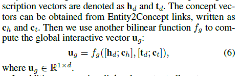 

+ 句子表示

文档中每个句子的表示是通过对句子中每个 token 的表示做最大池化操作得到的。
<!--
将在后续阶段使用。
-->

---

### 信息聚合

在上一步骤对每个**实体对**计算出了局部表示和全局表示，分别是 $\mathbf{u}_l$ 和 $\mathbf{u}_g$ ，使用一个向量门（按元素乘）将两者合并为实体对最终表示 $\mathbf{u}$。

 

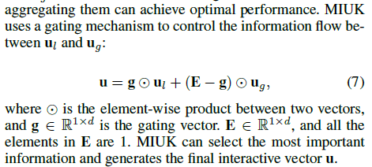

---

### 混合注意力

整个文档的表示使用混合注意力生成
所谓混合注意力指的是混合【实体对局部表示注意力】和【实体对全局表示注意力】。

这个文档表示 $\mathbf{v}$ 由文档中所有句子的表示生成。
基于特定实体对的局部和全局表示使用注意力机制。因此实际上文档对于【每个实体对】都生成特定的文档表示。
<!--
（这样计算量是否过大？）
--->

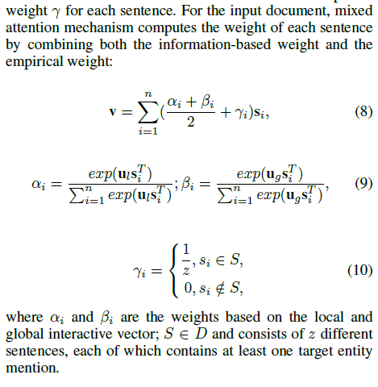

 

这里的伽马实际上解释的很不清楚。我的理解是对于每一对目标实体，$S$ 是从文档所有句子集合 $D$ 中选择的包含目标实体 mention 的句子集合。

---

### 预测

然后对某个实体对，将它的 final interactive vector 和文档表示拼接起来输入预测层。

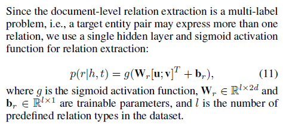 

每对实体可以输出多个标签。

---

## 实验

数据集：在文档及关系抽取中使用 DocRED，句子级使用 ACE2005 

使用 BERT-base 作为编码器，将vocab 中的罕见词作为锚点使用以避免重新训练 BERT

### Baseline

GCNN EoG 基于图的关系抽取。
BERT-Two-Step，DEMMT，GEDA，LSR 均使用了 BERT 作为编码器。

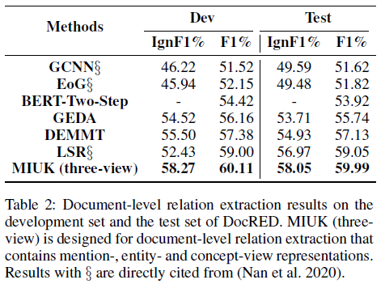

<!--
LSR 虽然在测试集表现也不错，但在开发集上 IgnF1 很低，而 MIUK 表现仍然很好，这说明我们的模型有更好的泛化性能。
-->

---

### 消融实验

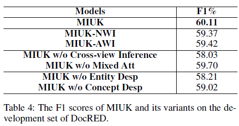

多视图框架和混合注意力都起到很大作用。如果去掉维基描述的嵌入，那么效果也会大幅降低。

---

## Conclusion

本文提出了MIUK，一个多视图推理框架，用于不确定知识的关系提取。 该推理机制将提及、实体和概念视图中的本地上下文和全局知识集成在一起。

 

对句子级和文档级关系提取任务的广泛实验结果验证了我们方法的有效性。

 

本文还构建了一个包含高质量实体和概念描述的语料库，作为关系提取和许多其他NLP任务的宝贵外部知识资源。

 

本文认为，进一步研究提及、实体和概念之间的相互作用可能是关系提取的未来研究方向。

